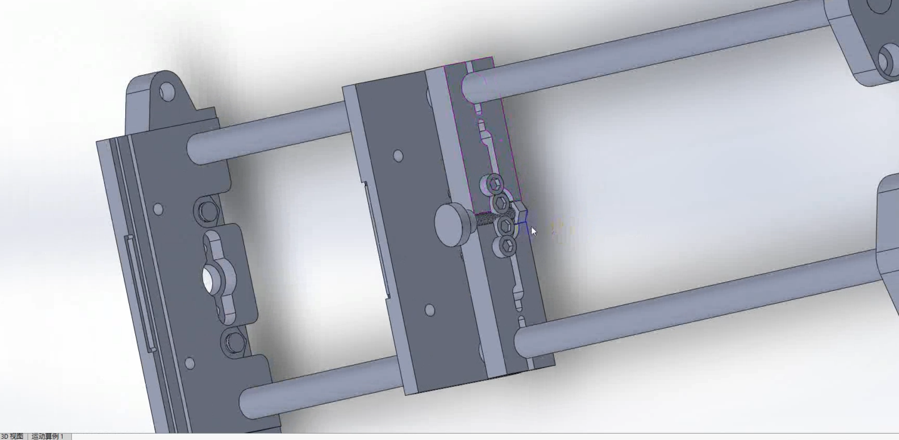
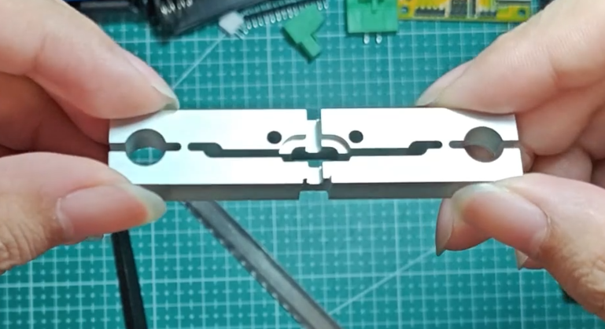
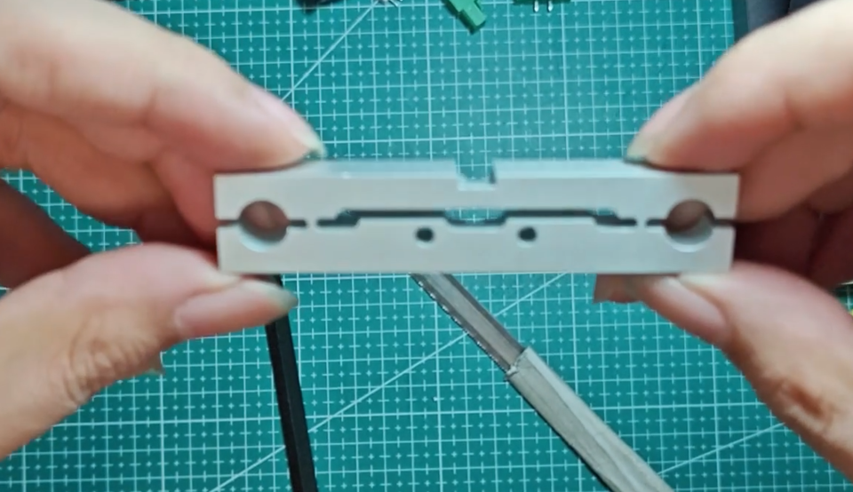
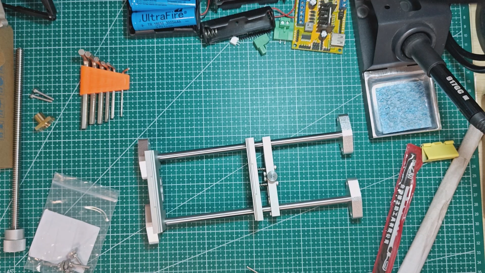
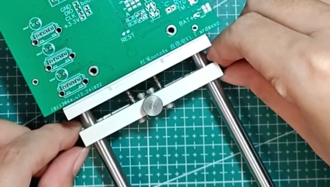

# v1.3_A(未成功)

制作PCB夹具请使用其他版本，该版本非PCB夹具夹片。

## 1. 说明

有反馈想要纯光轴的，所有我尝试了改装，但是失败了也可能是我改的方向不太对，白嫖的CNC有限制，暂时还没想到怎么优雅的改成可用的纯光轴版，有思路的欢迎提建议(Issues)。

## 2. Release

CNC-jlc-chunguangzhou-202411151810.STEP 改装件加工文件

## 3. 效果和预览图

