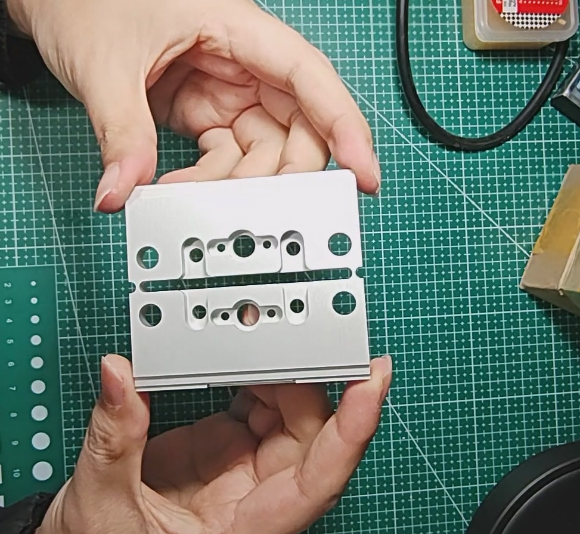
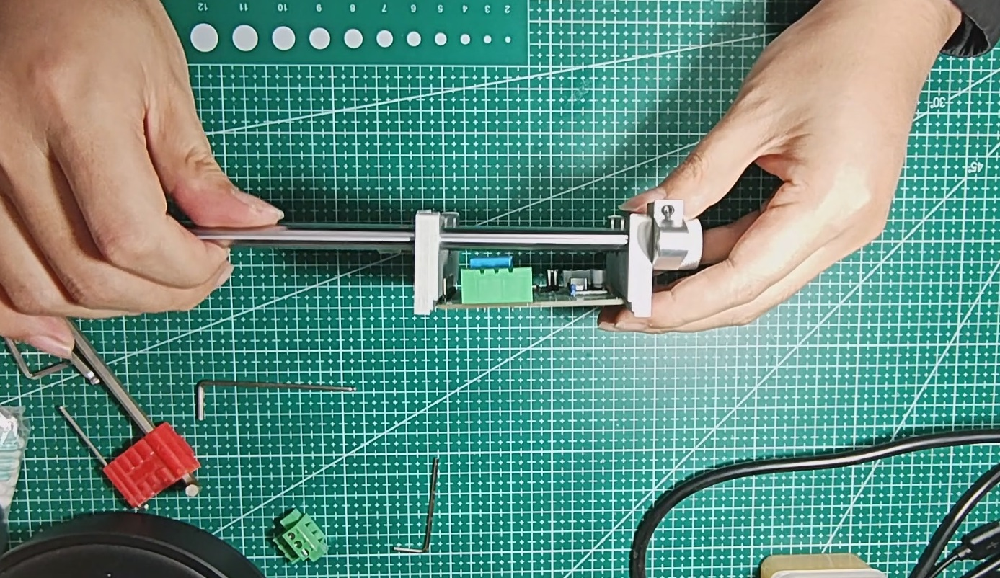

# 自制PCB夹具(PCB_Fixture)
使用五金标准件和简单CNC件组成的PCB夹具。PCB fixture composed of hardware standard parts and simple CNC parts.

## 1. 简介

- 由两片CNC加工件和一些五金标准件组成，CNC加工件可以在 [嘉立创1元CNC](https://www.jlc-cnc.com/ac/ACUHiDI0/CPWXDXgd) 白嫖(没免运费券的需要出个运费两片一共十来块，也可以用二合一版回去自己锯开，可省一次运费；**PS：二合一版虽然能省一次运费，但需要自己锯开，还要稍加打磨，如果比较想完美，也没有其他要占用CNC加工次数的加工件，而且还懒得费劲，那么用单个版（不带`one`的）应该是你的第一选择，一个月两次加工次数也够了，就是差个5-6块钱的事，实际根据自己情况来就行**)。

- 相比于网上大几十甚至上百的夹具，这个夹具不仅成本低，而且可以根据需要选择光轴和丝杆长度，组成不同夹持大小的夹具。

---
> 听劝挂了个商品，除CNC加工件之外的标准件套餐，懒得自己鼓捣的可以去看看 [「自制PCB夹具 配件一套(不含 cnc 加工件和安装工具)」](http://e.tb.cn/h.gAQCwxIyroVmxB7?tk=MRA93pnvb30)
> 配合 [嘉立创1元CNC](https://www.jlc-cnc.com/ac/ACUHiDI0/CPWXDXgd) 就能完成配件收集 `(*^_^*)`

## 2. 交流群

点击链接加入群聊【子金创作交流群 855828794】：[https://qm.qq.com/q/QZsBv7JgAw](https://qm.qq.com/q/QZsBv7JgAw)

## 3. Release获取加工文件

- `.STEP`文件既是CNC加工文件，在加工平台加工时用的就是这个文件
- 不同加工文件具体看Release中的说明

## 4. 视频教程

- [B站-自制PCB夹具视频集合](https://space.bilibili.com/646334431/lists/4469926?type=series)

- [抖音-自制PCB夹具视频](https://v.douyin.com/iAJgrt8c/)

## 5. 关注我了解最新动态

欢迎大家光临我的闲鱼 【闲鱼】https://m.tb.cn/h.TmkK9tq?tk=bM1le4dBSpc CZ005 「这是我的闲鱼号，快来看看吧～」

点击链接直接打开

## 6. 版本记录

- **v1.3_A**(预览版)(已测试但失败)

1. 增加纯光轴改装 (改装失败)

- **v1.2**(最新稳定)

1. 增加铨洲智造的打印件(待打样测试)，铨洲智造可以支持螺纹孔，但是一个螺纹孔要加一块钱(一共要加12)，如果想成本最低，可以用嘉立创版本加工，可以兼容的；
2. 夹片靠上部位增加两个螺丝孔，可以方便后面扩展夹头(如果有的话，可以自己DIY设计，算是一个扩展吧)；

- **v1.1**

1. 增加BOM表文件；
2. 优化三个杆的布局(杆更低可以倒扣着焊接插件器件)；
3. 增加二合一文件，一次就可以加工所有cnc件(需要拿回来后自己锯开，根据情况选择)；
4. 优化夹持芯片的小槽深度，夹持芯片更方便操作；

- **v1.0**

1. 1.0版本为比较简单的，由两片CNC件和五金标准件组成，可以在 [嘉立创1元CNC](https://www.jlc-cnc.com/ac/ACUHiDI0/CPWXDXgd) 白嫖(没免运费券的需要出个运费两片十来块)。
2. 相比于网上大几十甚至上百的夹具，这个夹具不仅成本低，而且可以根据需要选择光轴和丝杆长度，组成不同夹持大小的夹具。

## 7. 效果图

