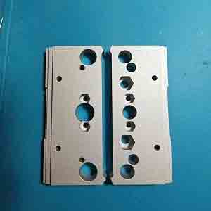

# 自制PCB夹具BOM表

## 1. 有轴套

【嘉立创CNC】我正在参加嘉立创CNC特价板类零件免费打样活动，点击和我一起参加免费打样CNC零件吧：
https://www.jlc-cnc.com/ac/ACUHiDI0/CP2tCHBI

| 编号 |                               名称                               |                                          图片                                          |             数量             |    类型    |                                                                                                                                 备注                                                                                                                                 |
| ---- | --------------------------------------------------------------- | -------------------------------------------------------------------------------------- | ---------------------------- | --------- | ------------------------------------------------------------------------------------------------------------------------------------------------------------------------------------------------------------------------------------------------------------------- |
| 1    | [夹具CNC加工件](http://e.tb.cn/h.gAQCwxIyroVmxB7?tk=MRA93pnvb30) |                       | one版本\*1(或固定\*1+活动\*1) | CNC加工件  | [【嘉立创CNC】特价板类零件免费打样活动 https://www.jlc-cnc.com/ac/ACUHiDI0/CP2tCHBI](https://www.jlc-cnc.com/ac/ACUHiDI0/CP2tCHBI) 如果使用合一的加工，可以省一次的钱，但需要收到后自己锯开，自己没法加工的或者嫌麻烦，或者求完美的，可以加工非合一的，一个月两次也够，就是会多一次邮费 |
| 2    | 复合轴套 高8内径8外径10                                           |                                 | 2                            | 五金标准件 |                                                                                                                                                                                                                                                                     |
| 3    | M3×20螺丝(18~20都可以)                                           |                               | 2                            | 五金标准件 |                                                                                                                                                                                                                                                                     |
| 4    | M3×8螺丝(6~8都可以)                                              |                              | 2                            | 五金标准件 |                                                                                                                                                                                                                                                                     |
| 5    | M3×12螺丝                                                        |                              | 2                            | 五金标准件 |                                                                                                                                                                                                                                                                     |
| 6    | M3六角螺母                                                       |                             | 4                            | 五金标准件 |                                                                                                                                                                                                                                                                     |
| 7    | M3垫片                                                           |                                    | 4                            | 五金标准件 |                                                                                                                                                                                                                                                                     |
| 8    | M5×12杯头螺丝(10~12都可以)                                        |                              | 2                            | 五金标准件 |                                                                                                                                                                                                                                                                     |
| 9    | M5六角螺母                                                       |                             | 2                            | 五金标准件 |                                                                                                                                                                                                                                                                     |
| 10   | 0.6×5×10弹簧                                                     |                        | 2                            | 五金标准件 |                                                                                                                                                                                                                                                                     |
| 11   | 沉孔SHF8-卧式支架光轴支架                                          |  | 4                            | 五金标准件 |                                                                                                                                                                                                                                                                     |
| 12   | 光轴8mm                                                          |                                  | 夹持PCB尺寸+5cm\*2            | 五金标准件 |                                                                                                                                                                                                                                                                     |
| 13   | T8丝杆                                                           |                                    | 夹持PCB尺寸+5cm\*1            | 五金标准件 | 推荐导程8,短的可以用2mm导程(默认)或4mm导程，长的建议用8mm导程，下单丝杆时可以备注;下单时记得备注要切边法兰螺母                                                                                                                                                                 |
| 14   | T8切边螺母                                                       |                             | 1                            | 五金标准件 | 一般和丝杆配套使用，也就是导程螺距一样，建议和丝杆同时购买，单独购买时一定要说清楚导程螺距不然可能不能用                                                                                                                                                                        |
| 15   | 铝合金手轮圆形旋钮(外径20内径8)                                    |               | 1                            | 五金标准件 |                                                                                                                                                                                                                                                                     |

> 以上即有轴套版本夹具的所有物品清单，也可以直接从我这购买配件包，或者订购整套成品！
> 
> 感觉不错就来支持一下作者吧！
> 
> 直购链接：[【淘宝】http://e.tb.cn/h.gAQCwxIyroVmxB7?tk=MRA93pnvb30 CZ0001 「自制PCB夹具)」](http://e.tb.cn/h.gAQCwxIyroVmxB7?tk=MRA93pnvb30)

组装视频教程

- [B站-自制PCB夹具视频集合 https://space.bilibili.com/646334431/lists/4469926?type=series](https://space.bilibili.com/646334431/lists/4469926?type=series)

- [抖音-自制PCB夹具视频 https://v.douyin.com/iAJgrt8c/](https://v.douyin.com/iAJgrt8c/)

## 2. 无轴套

【嘉立创CNC】我正在参加嘉立创CNC特价板类零件免费打样活动，点击和我一起参加免费打样CNC零件吧：
https://www.jlc-cnc.com/ac/ACUHiDI0/CP2tCHBI

| 编号 |                               名称                               |                                          图片                                          |             数量             |    类型    |                                                                                                                                 备注                                                                                                                                 |
| ---- | --------------------------------------------------------------- | -------------------------------------------------------------------------------------- | ---------------------------- | --------- | ------------------------------------------------------------------------------------------------------------------------------------------------------------------------------------------------------------------------------------------------------------------- |
| 1    | [夹具CNC加工件](http://e.tb.cn/h.gAQCwxIyroVmxB7?tk=MRA93pnvb30) |                       | one版本\*1(或固定\*1+活动\*1) | CNC加工件  | [【嘉立创CNC】特价板类零件免费打样活动 https://www.jlc-cnc.com/ac/ACUHiDI0/CP2tCHBI](https://www.jlc-cnc.com/ac/ACUHiDI0/CP2tCHBI) 如果使用合一的加工，可以省一次的钱，但需要收到后自己锯开，自己没法加工的或者嫌麻烦，或者求完美的，可以加工非合一的，一个月两次也够，就是会多一次邮费 |
| 2    | M3×20螺丝(18~20都可以)                                           |                               | 2                            | 五金标准件 |                                                                                                                                                                                                                                                                     |
| 3    | M3×8螺丝(6~8都可以)                                              |                              | 2                            | 五金标准件 |                                                                                                                                                                                                                                                                     |
| 4    | M3六角螺母                                                       |                             | 4                            | 五金标准件 |                                                                                                                                                                                                                                                                     |
| 5    | M5×12杯头螺丝(10~12都可以)                                        |                              | 2                            | 五金标准件 |                                                                                                                                                                                                                                                                     |
| 6    | M5六角螺母                                                       |                             | 2                            | 五金标准件 |                                                                                                                                                                                                                                                                     |
| 7    | 0.6×5×10弹簧                                                     |                        | 2                            | 五金标准件 |                                                                                                                                                                                                                                                                     |
| 8    | 沉孔SHF8-卧式支架光轴支架                                          |  | 4                            | 五金标准件 |                                                                                                                                                                                                                                                                     |
| 9    | 光轴8mm                                                          |                                  | 夹持PCB尺寸+5cm\*2            | 五金标准件 |                                                                                                                                                                                                                                                                     |
| 10   | T8丝杆                                                           |                                    | 夹持PCB尺寸+5cm\*1            | 五金标准件 | 推荐导程8,短的可以用2mm导程(默认)或4mm导程，长的建议用8mm导程，下单丝杆时可以备注;下单时记得备注要切边法兰螺母                                                                                                                                                                 |
| 11   | T8切边螺母                                                       |                             | 1                            | 五金标准件 | 一般和丝杆配套使用，也就是导程螺距一样，建议和丝杆同时购买，单独购买时一定要说清楚导程螺距不然可能不能用                                                                                                                                                                        |
| 12   | 铝合金手轮圆形旋钮(外径20内径8)                                    |               | 1                            | 五金标准件 |                                                                                                                                                                                                                                                                     |

> 以上即有轴套版本夹具的所有物品清单，也可以直接从我这购买配件包，或者订购整套成品！
> 
> 感觉不错就来支持一下作者吧！
> 
> 直购链接：[【淘宝】http://e.tb.cn/h.gAQCwxIyroVmxB7?tk=MRA93pnvb30 CZ0001 「自制PCB夹具)」](http://e.tb.cn/h.gAQCwxIyroVmxB7?tk=MRA93pnvb30)

组装视频教程

- [B站-自制PCB夹具视频集合 https://space.bilibili.com/646334431/lists/4469926?type=series](https://space.bilibili.com/646334431/lists/4469926?type=series)

- [抖音-自制PCB夹具视频 https://v.douyin.com/iAJgrt8c/](https://v.douyin.com/iAJgrt8c/)
